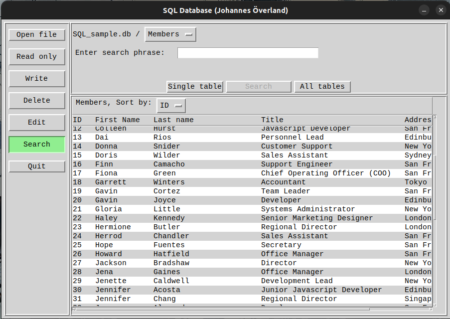

# Database Viewer
Run with python versions 3 and up

## Description
Graphical dql database ui that handles reading, writing, editing, deletion of data fields.
Supports simultaneous display of search results from multiple tables at once.

## Dummy data
Run sql_functions.py as a script in order to create two example db-files in the local folder.

## Screenshot
