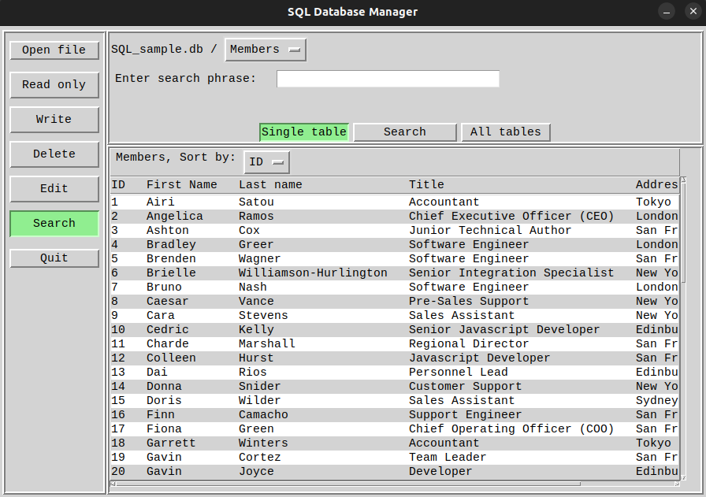

# Database Viewer
Run with python versions 3+

## Description
Graphical sqlite database ui that handles db-files; reading, writing, editing and deletion of data.
Supports simultaneous display of search results from multiple tables at once.

## Dummy data
Run sql_functions.py as a script in order to create two db-files.

## Screenshot
